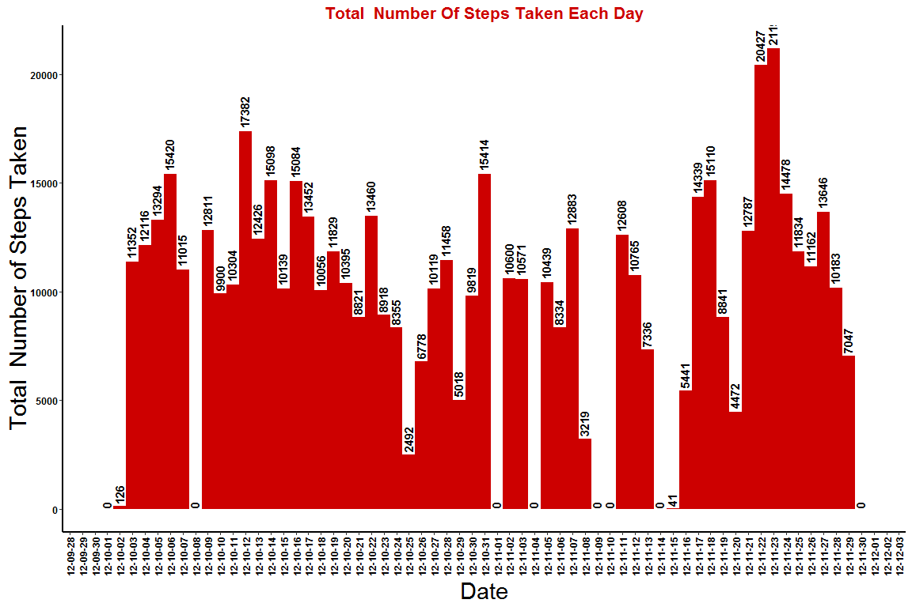
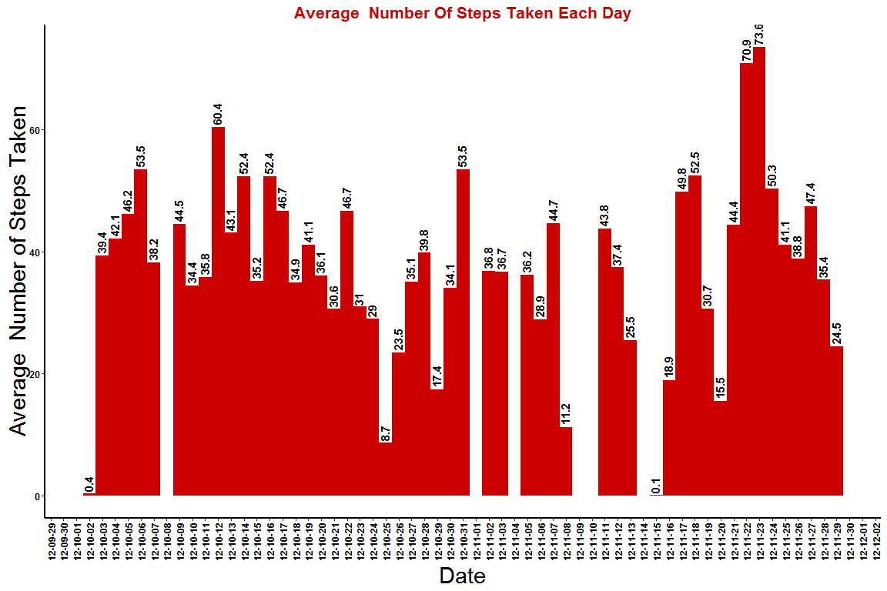
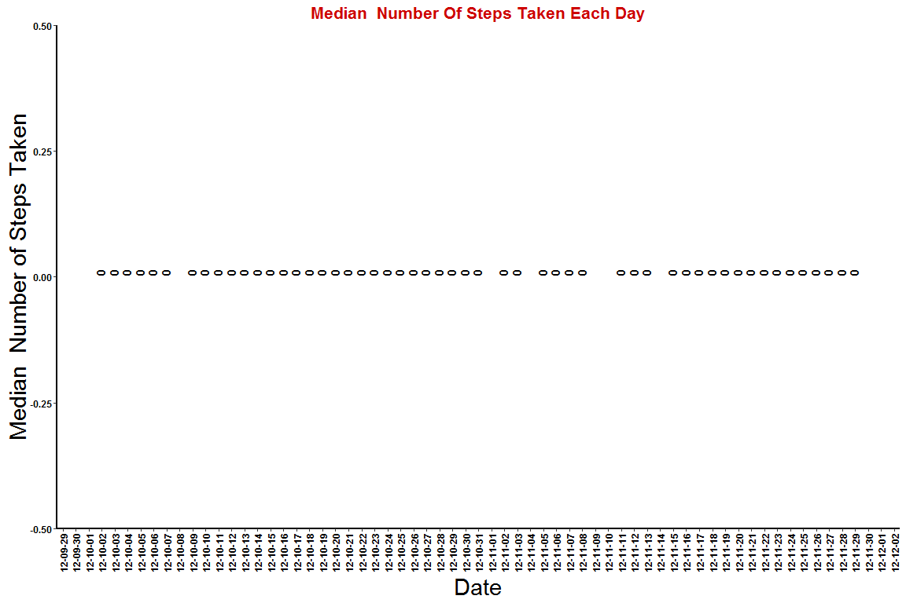
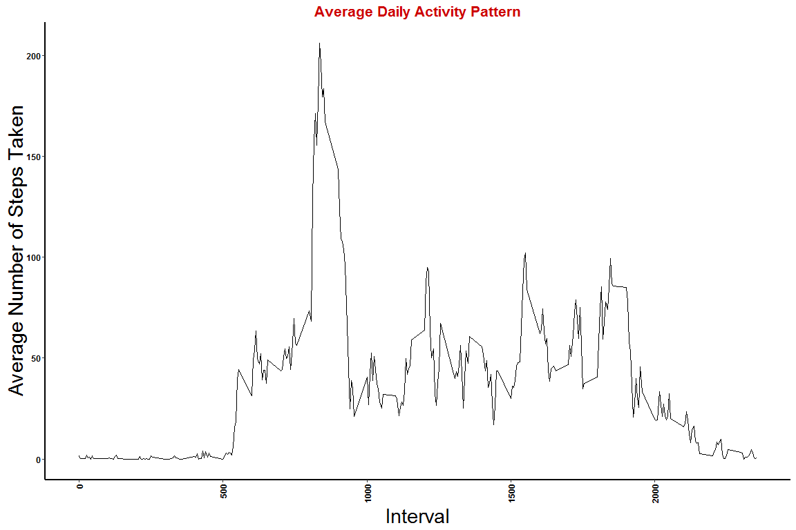
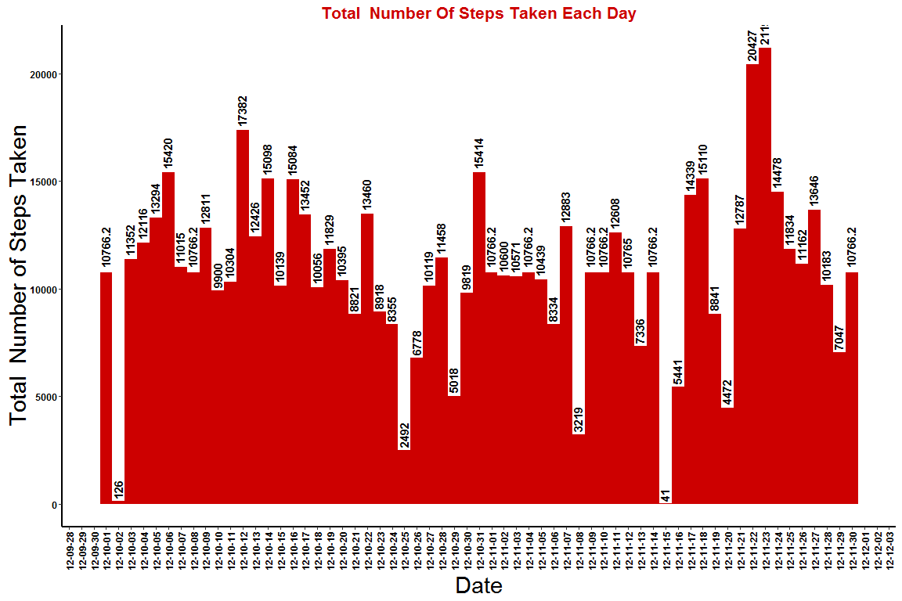
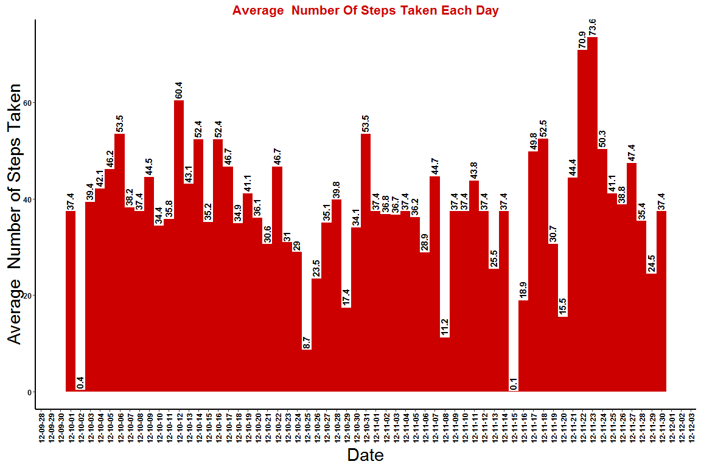
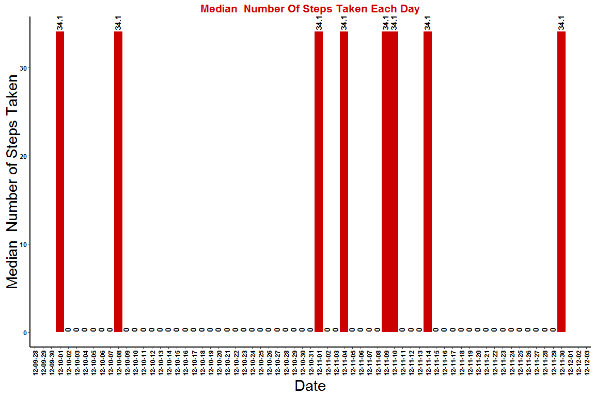
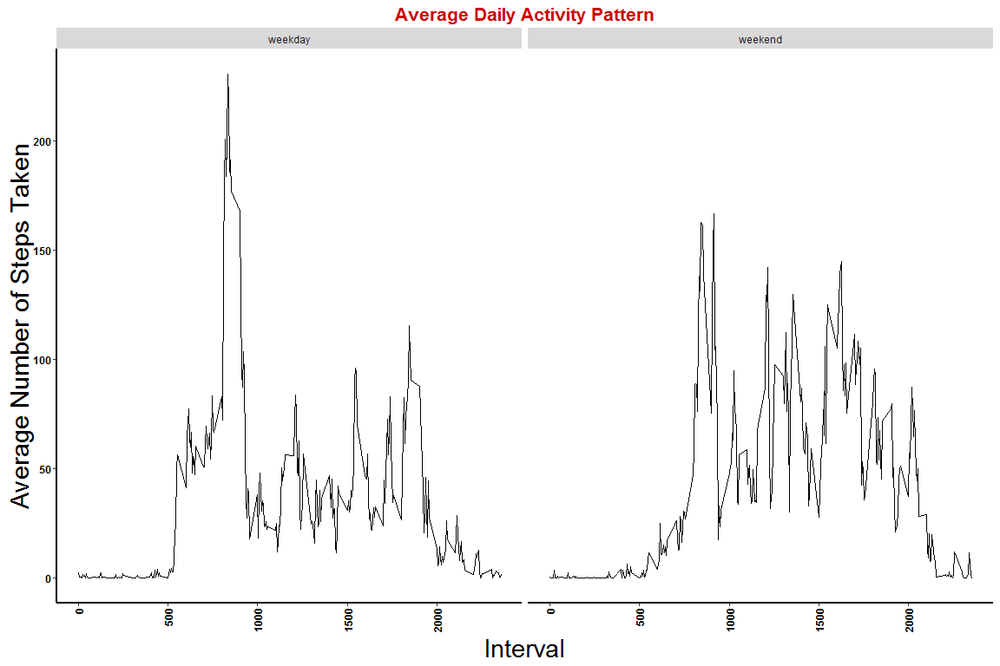

# Reproducible Research: Peer Assessment 1

## Loading required libraries

```r
# Required libraries
library(ggplot2)
```

```
## Warning: package 'ggplot2' was built under R version 3.2.3
```

```r
library(scales)
```

```
## Warning: package 'scales' was built under R version 3.2.3
```

```r
library(lubridate)
```

```
## Warning: package 'lubridate' was built under R version 3.2.3
```

## Loading and preprocessing the data

```r
# Local data zip file
dataFileZIP <- "./Dataset.zip"

# Download the dataset (. ZIP), if it does not exist
if (file.exists(dataFileZIP) == FALSE) {
  # Sometimes changing https to http and skip method="curl" 
  # in the download.file works if having problems with curl
  fileUrl <- "https://d396qusza40orc.cloudfront.net/repdata%2Fdata%2Factivity.zip"
  download.file(fileUrl, destfile = "Dataset.zip")
}

# Uncompress data file if non exists
if (file.exists("activity.csv") == FALSE) {
   unzip("./Dataset.zip")
}

############Read Data##################
activity <- read.csv("activity.csv")
#Format date column
activity$date <- format(as.Date(activity$date), "%Y/%m/%d")
activity$date <- as.Date(activity$date)
activity$time <- seconds_to_period(activity$interval*60)

#Function for plotting histogram
plotbar <- function(bar.data,labely){
  ymax <- round(max(bar.data$steps),0)
  ymax
  #Change decimal value to a number. Round percent to one decimal place
  bar.data$steps <- round(bar.data$steps, 1)
  ggplot(bar.data ,aes(x = date,y = steps)) + 
  geom_bar(stat="identity",position = "dodge", fill = "#CD0000", width=1) +
  xlab("Date") + 
  ylab(paste(labely, "Number of Steps Taken", sep=" "))+
  ggtitle(paste(labely, "Number Of Steps Taken Each Day", sep=" "))+
  scale_x_date(breaks = date_breaks("1 day"), labels=date_format("%y-%m-%d"))+
  geom_text(aes(label = steps), 
            size = rel(4), 
            hjust=-.1, 
            angle = 90,
            vjust=.35,
            fontface="bold",
            position = position_dodge(width=1))+
  theme(axis.text.x = element_text(angle = 90, hjust = 1, vjust=.5, 
                                   face="bold", color ="black", size =rel(1)),
        axis.title.x = element_text(size = rel(2),vjust= -.5),
        axis.text.y = element_text(face="bold", color="black", size =rel(1)),
        axis.title.y = element_text(size = rel(2), angle = 90,vjust=-.5),
        panel.grid.major = element_blank(), 
        panel.grid.minor = element_blank(), 
        panel.background = element_rect(fill = "transparent"),
        axis.line = element_line(colour = "black", size=1, linetype = "solid"),
        plot.title = element_text(vjust=-8,lineheight=.8, face="bold",
                                  color="#CD0000", size=16))
}

#Function for plotting line graph
plotline <- function(line.data,labely){
  ggplot(line.data ,aes(x = interval,y = steps)) + 
  geom_line(linetype=1) +
  xlab("Interval") + 
  ylab(paste(labely, "Number of Steps Taken", sep=" "))+
  ggtitle(paste(labely, "Daily Activity Pattern", sep=" "))+
  theme(axis.text.x = element_text(angle = 90, hjust = 1, vjust=.5, 
                                   face="bold", color ="black", size =rel(1)),
        axis.title.x = element_text(size = rel(2),vjust= -.5),
        axis.text.y = element_text(face="bold", color="black", size =rel(1)),
        axis.title.y = element_text(size = rel(2), angle = 90,vjust=-.5),
        panel.grid.major = element_blank(), 
        panel.grid.minor = element_blank(), 
        panel.background = element_rect(fill = "transparent"),
        axis.line = element_line(colour = "black", size=1, linetype = "solid"),
        plot.title = element_text(vjust=2,lineheight=.8, face="bold",
                                  color="#CD0000", size=16))
}
```


## What is mean total number of steps taken per day?
1. Calculate the total number of steps taken per day

```r
#Subsetting and aggregating based on day
activity.s <- activity["steps"] 
activity.d <- activity["date"]
#Total steps taken per day
sum.activity.steps.day <- aggregate(activity.s, activity.d, sum, na.rm=TRUE)
```

2. Make a histogram of the total number of steps taken each day

```r
plotbar(sum.activity.steps.day, "Total ")
```

 


3. Calculate and report the mean and median of the total number of steps taken per day

```r
#Average steps taken per day
mean.activity.steps.day <- aggregate(steps~date, activity, mean)
plotbar(mean.activity.steps.day, "Average ")
```

 

```r
#Median steps taken per day
median.activity.steps.day <- aggregate(steps~date, activity, median)
plotbar(median.activity.steps.day, "Median ")
```

 


## What is the average daily activity pattern?
1. Make a time series plot (i.e. type = "l") of the 5-minute interval (x-axis) and the average number of steps taken, averaged across all days (y-axis)

```r
#Subsetting and aggregating based on day
activity.s <- activity["steps"] 
activity.i <- activity["interval"]
#Mean steps per 5 minutes interval
mean.activity.steps.interval <- aggregate(activity.s, activity.i, mean, na.rm=TRUE)
plotline(mean.activity.steps.interval, "Average")
```

 


2. Which 5-minute interval, on average across all the days in the dataset, contains the maximum number of steps?

```r
mean.activity.steps.interval[ mean.activity.steps.interval$steps== max(mean.activity.steps.interval$steps),]
```

```
##     interval    steps
## 104      835 206.1698
```


## Imputing missing values
1. Calculate and report the total number of missing values in the dataset (i.e. the total number of rows with NAs)

```r
#Method 1
summary(activity)
```

```
##      steps             date               interval     
##  Min.   :  0.00   Min.   :2012-10-01   Min.   :   0.0  
##  1st Qu.:  0.00   1st Qu.:2012-10-16   1st Qu.: 588.8  
##  Median :  0.00   Median :2012-10-31   Median :1177.5  
##  Mean   : 37.38   Mean   :2012-10-31   Mean   :1177.5  
##  3rd Qu.: 12.00   3rd Qu.:2012-11-15   3rd Qu.:1766.2  
##  Max.   :806.00   Max.   :2012-11-30   Max.   :2355.0  
##  NA's   :2304                                          
##       time              
##  Min.   :0S             
##  1st Qu.:9H 48M 45S     
##  Median :19H 37M 30S    
##  Mean   :19H 37M 30S    
##  3rd Qu.:1d 5H 26M 15S  
##  Max.   :1d 15H 15M 0S  
## 
```

```r
#Method 2
sum(is.na(activity))
```

```
## [1] 2304
```

2. Devise a strategy for filling in all of the missing values in the dataset. The strategy does not need to be sophisticated. For example, you could use the mean/median for that day, or the mean for that 5-minute interval, etc.

```r
#Change Column name
colnames(activity.s) <- "average_steps"
#Mean steps per 5 minutes interval
mean.activity.steps.interval <- aggregate(activity.s, activity.i, mean, na.rm=TRUE)
activity <- merge(activity, mean.activity.steps.interval, by = "interval", all=TRUE)
```

3. Create a new dataset that is equal to the original dataset but with the missing data filled in.

```r
#Create new dataset
activity.imputed <- transform(activity, steps = ifelse(!is.na(steps), steps, average_steps))
```

4. Make a histogram of the total number of steps taken each day and Calculate and report the mean and median total number of steps taken per day. Do these values differ from the estimates from the first part of the assignment? What is the impact of imputing missing data on the estimates of the total daily number of steps?

```r
#Total Steps taken per day
sum.activity.imputed <- aggregate(steps~date, activity.imputed, sum)
plotbar(sum.activity.imputed, "Total ")
```

 

```r
#Average steps taken per day
mean.activity.imputed <- aggregate(steps~date, activity.imputed, mean)
plotbar(mean.activity.imputed, "Average ")
```

 

```r
#Median steps taken per day
median.activity.imputed <- aggregate(steps~date, activity.imputed, median)
plotbar(median.activity.imputed, "Median ")
```

 


## Are there differences in activity patterns between weekdays and weekends?
1. Create a new factor variable in the dataset with two levels - "weekday" and "weekend" indicating whether a given date is a weekday or weekend day.

```r
activity.imputed$day <- weekdays(activity.imputed$date)
# now populate a new factor column using day of the week and a simple function
activity.imputed$day.type <- as.factor(apply(activity.imputed["day"], 1, function(x) {
  switch(x,
         "Sunday" = "weekend", 
         "Saturday" = "weekend",
         "weekday")
}))
```

2. Make a panel plot containing a time series plot (i.e. type = "l") of the 5-minute interval (x-axis) and the average number of steps taken, averaged across all weekday days or weekend days (y-axis). See the README file in the GitHub repository to see an example of what this plot should look like using simulated data.

```r
#Mean steps by interval and day type
mean.activity.imputed.interval <- aggregate(list(steps=activity.imputed$steps),
                      list(interval = activity.imputed$interval, 
                      day.type =   activity.imputed$day.type),mean)

plotline(mean.activity.imputed.interval, "Average")+
  facet_wrap(~day.type)
```

 

